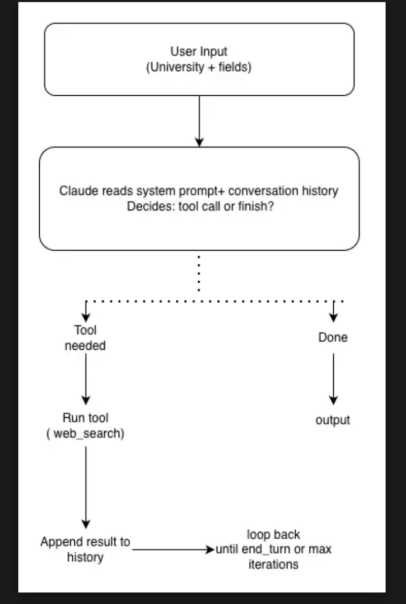

# overview
This is a single-agent system that takes US university name and the research field or simply the major
then autonomously discovers professors at that university whose work matches those fields. It outputs 
each matching professor's name, title, department, research focus, profile URL and LAB URL if available.

# The agent loop

